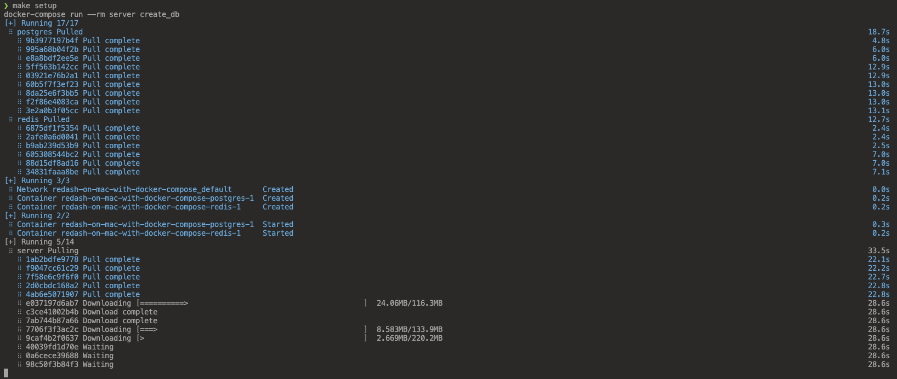

# &#x1F6A9; Redash on Mac with docker-compose

Running Redash locally on MacOS.

Prerequisites: `docker-compose`

### &#x1FAB4; Steps :

- `0.` -  clone the repo and cd into the dir
- `1.` -  `make setup` - one time setup (first time only)
- `2.` -  `make start` - starts the service on http://localhost:8000/
- `3.` -  `make stop` - stops the service

### overview during the development process :

    

    ❯ docker images

        REPOSITORY      TAG            IMAGE ID       CREATED         SIZE
        redis           5.0-alpine     8ab49366732f   16 months ago   22.6MB
        postgres        9.6-alpine     a368e0e3b16f   2 years ago     53.1MB
        redash/redash   8.0.0.b32245   1b48a51810b5   4 years ago     1.31GB

### &#x1FAA7; Notes : 

    ❯ docker --version

        Docker version 20.10.14, build a224086