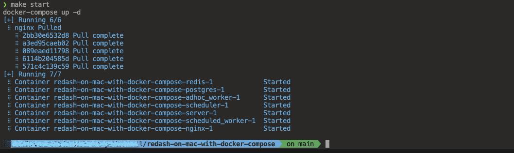
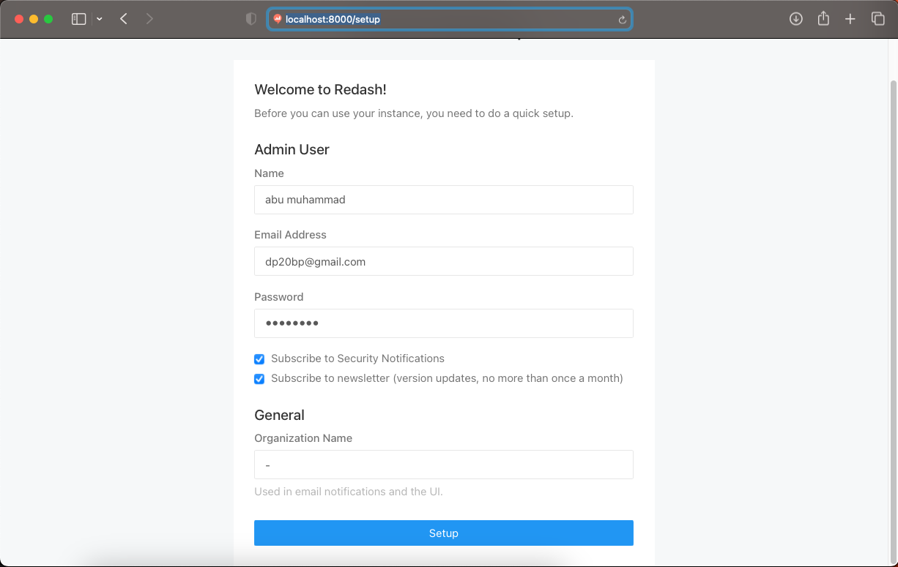
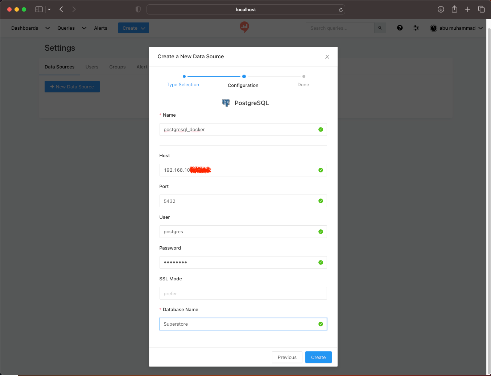
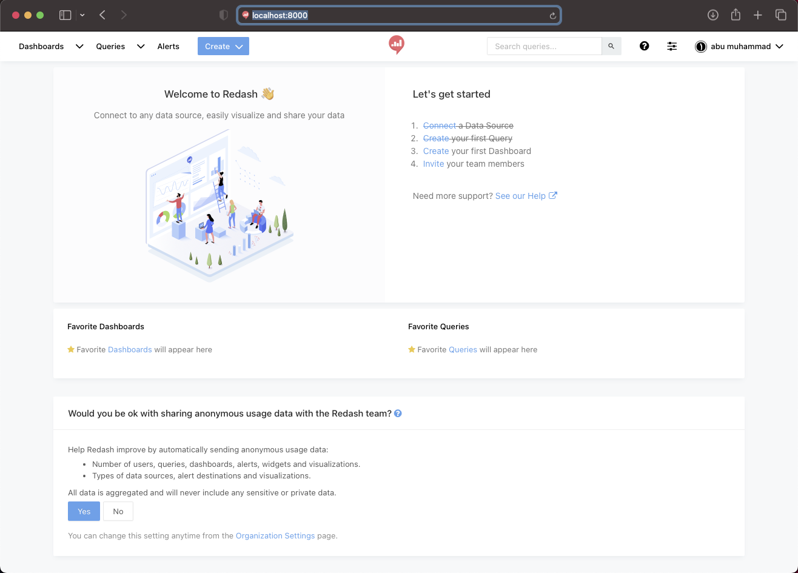
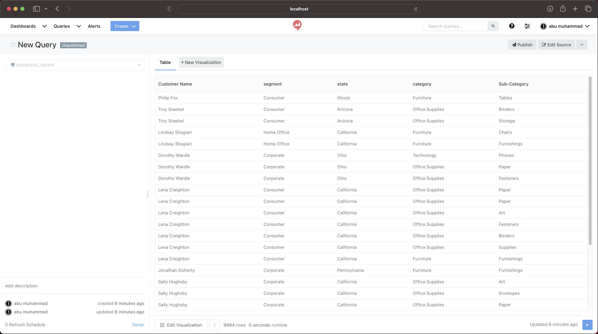

# &#x1F6A9; Redash on Mac with docker-compose

Running Redash locally on MacOS.

Prerequisites: `docker-compose`

### &#x1FAB4; Steps :

- `0.` -  clone the repo and cd into the dir
- `1.` -  `make setup` - one time setup (first time only)
- `2.` -  `make start` - starts the service on http://localhost:8000/
- `3.` -  `make stop` - stops the service

### overview during the development process :

step - 1

    

    ❯ docker images

        REPOSITORY      TAG            IMAGE ID       CREATED         SIZE
        redis           5.0-alpine     8ab49366732f   16 months ago   22.6MB
        postgres        9.6-alpine     a368e0e3b16f   2 years ago     53.1MB
        redash/redash   8.0.0.b32245   1b48a51810b5   4 years ago     1.31GB

    ❯ docker ps -a

        CONTAINER ID   IMAGE                 COMMAND                  CREATED         STATUS         PORTS      NAMES
        a5581f81ddff   postgres:9.6-alpine   "docker-entrypoint.s…"   8 minutes ago   Up 8 minutes   5432/tcp   redash-on-mac-with-docker-compose-postgres-1
        d52b9f5cec04   redis:5.0-alpine      "docker-entrypoint.s…"   8 minutes ago   Up 8 minutes   6379/tcp   redash-on-mac-with-docker-compose-redis-1

    ❯ docker exec -it redash-on-mac-with-docker-compose-postgres-1 /bin/sh

        / # psql --version
        psql (PostgreSQL) 9.6.24

        / # psql -h localhost -p 5432 -U postgres
        psql (9.6.24)
        Type "help" for help.

        postgres=# \l
                                        List of databases
        Name    |  Owner   | Encoding |  Collate   |   Ctype    |   Access privileges   
        -----------+----------+----------+------------+------------+-----------------------
        postgres  | postgres | UTF8     | en_US.utf8 | en_US.utf8 | 
        template0 | postgres | UTF8     | en_US.utf8 | en_US.utf8 | =c/postgres          +
                |          |          |            |            | postgres=CTc/postgres
        template1 | postgres | UTF8     | en_US.utf8 | en_US.utf8 | =c/postgres          +
                |          |          |            |            | postgres=CTc/postgres
        (3 rows)

        postgres=# \c postgres 
        You are now connected to database "postgres" as user "postgres".

        postgres=# \d
                                List of relations
        Schema |               Name               |   Type   |  Owner   
        --------+----------------------------------+----------+----------
        public | access_permissions               | table    | postgres
        public | access_permissions_id_seq        | sequence | postgres
        public | alembic_version                  | table    | postgres
        public | alert_subscriptions              | table    | postgres
        public | alert_subscriptions_id_seq       | sequence | postgres
        public | alerts                           | table    | postgres
        public | alerts_id_seq                    | sequence | postgres
        public | api_keys                         | table    | postgres
        public | api_keys_id_seq                  | sequence | postgres
        public | changes                          | table    | postgres
        public | changes_id_seq                   | sequence | postgres
        public | dashboards                       | table    | postgres
        public | dashboards_id_seq                | sequence | postgres
        public | data_source_groups               | table    | postgres
        public | data_source_groups_id_seq        | sequence | postgres
        public | data_sources                     | table    | postgres
        public | data_sources_id_seq              | sequence | postgres
        public | events                           | table    | postgres
        public | events_id_seq                    | sequence | postgres
        public | favorites                        | table    | postgres
        public | favorites_id_seq                 | sequence | postgres
        public | groups                           | table    | postgres
        public | groups_id_seq                    | sequence | postgres
        public | notification_destinations        | table    | postgres
        public | notification_destinations_id_seq | sequence | postgres
        public | organizations                    | table    | postgres
        public | organizations_id_seq             | sequence | postgres
        public | queries                          | table    | postgres
        public | queries_id_seq                   | sequence | postgres
        public | query_results                    | table    | postgres
        public | query_results_id_seq             | sequence | postgres
        public | query_snippets                   | table    | postgres
        public | query_snippets_id_seq            | sequence | postgres
        public | users                            | table    | postgres
        public | users_id_seq                     | sequence | postgres
        public | visualizations                   | table    | postgres
        public | visualizations_id_seq            | sequence | postgres
        public | widgets                          | table    | postgres
        public | widgets_id_seq                   | sequence | postgres
        (39 rows)

step - 2

    

    ❯ docker images

        REPOSITORY      TAG            IMAGE ID       CREATED         SIZE
        redis           5.0-alpine     8ab49366732f   16 months ago   22.6MB
        postgres        9.6-alpine     a368e0e3b16f   2 years ago     53.1MB
        redash/nginx    latest         2a6299d40898   3 years ago     134MB
        redash/redash   8.0.0.b32245   1b48a51810b5   4 years ago     1.31GB

    ❯ docker ps -a --format "table {{.ID}}\t{{.Image}}\t{{.Status}}\t{{.Names}}\t{{.Ports}}"

        CONTAINER ID   IMAGE                        STATUS         NAMES                                                  PORTS
        50194c1b3264   redash/nginx:latest          Up 4 minutes   redash-on-mac-with-docker-compose-nginx-1              443/tcp, 0.0.0.0:8000->80/tcp
        560a336cf1ae   redash/redash:8.0.0.b32245   Up 4 minutes   redash-on-mac-with-docker-compose-scheduled_worker-1   5000/tcp
        63bcaa664b8c   redash/redash:8.0.0.b32245   Up 4 minutes   redash-on-mac-with-docker-compose-server-1             0.0.0.0:5000->5000/tcp
        47ab15c89890   redash/redash:8.0.0.b32245   Up 4 minutes   redash-on-mac-with-docker-compose-adhoc_worker-1       5000/tcp
        4a89f691b1c5   redash/redash:8.0.0.b32245   Up 4 minutes   redash-on-mac-with-docker-compose-scheduler-1          5000/tcp
        a34f6c5c39b5   redis:5.0-alpine             Up 4 minutes   redash-on-mac-with-docker-compose-redis-1              6379/tcp
        c903fb2a4eeb   postgres:9.6-alpine          Up 4 minutes   redash-on-mac-with-docker-compose-postgres-1           5432/tcp

    ❯ tree -L 2 -I 'gambar-petunjuk|README.md'

            ├── Makefile
            ├── docker-compose.yml
            ├── env
            └── postgres-data
                ├── PG_VERSION
                ├── base
                ├── global
                ├── pg_clog
                ├── pg_commit_ts
                ├── pg_dynshmem
                ├── pg_hba.conf
                ├── pg_ident.conf
                ├── pg_logical
                ├── pg_multixact
                ├── pg_notify
                ├── pg_replslot
                ├── pg_serial
                ├── pg_snapshots
                ├── pg_stat
                ├── pg_stat_tmp
                ├── pg_subtrans
                ├── pg_tblspc
                ├── pg_twophase
                ├── pg_xlog
                ├── postgresql.auto.conf
                ├── postgresql.conf
                ├── postmaster.opts
                └── postmaster.pid

---

### &#x1F525; Result :

    

    

    

    

    

---

### &#x1FAA7; Notes : 

    ❯ docker --version

        Docker version 20.10.14, build a224086